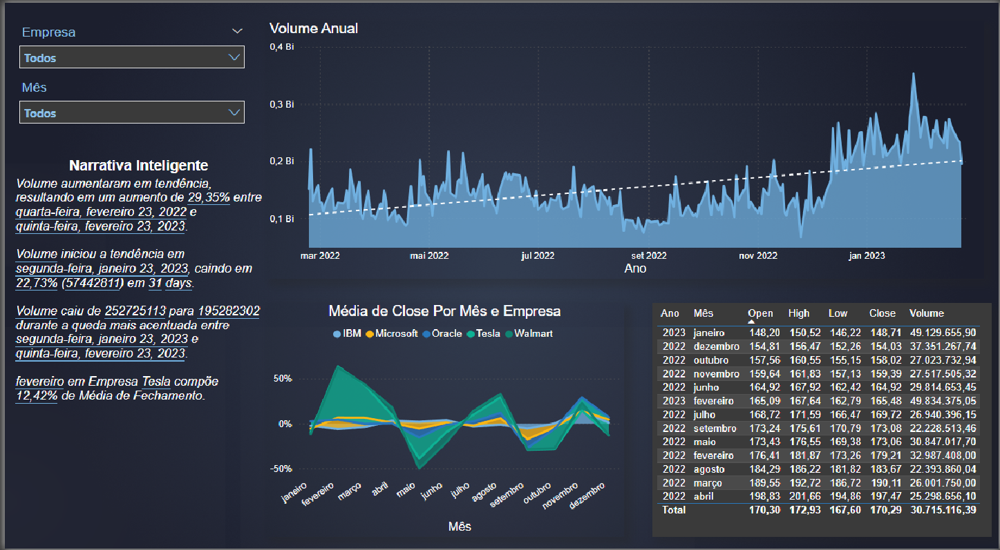

# Mercado de Ações

📖 Sobre o Projeto
Este projeto consiste em um dashboard interativo desenvolvido em Power BI para a análise de desempenho de ações de grandes empresas de tecnologia e varejo. O painel oferece uma visão consolidada sobre o volume de negociações, preços de fechamento (Close) e tendências de mercado ao longo do tempo, permitindo uma análise detalhada e comparativa.

🎯 Objetivos e Perguntas de Negócio Respondidas
Este dashboard foi desenvolvido para responder às seguintes questões-chave sobre o desempenho de ações no mercado financeiro:

Qual o total de volume negociado de ações ao longo do tempo para as 5 empresas analisadas, permitindo a filtragem por empresa?

Qual o valor médio de abertura (Open), máximo (High), mínimo (Low) e de fechamento (Close) das ações para todos os meses do período, com a visualização em formato de tabela e com filtros por empresa?

Qual a variação da média do valor de fechamento (close) das ações, mês a mês, para uma ou mais empresas?

Como utilizar a Narrativa Inteligente para resumir e explicar as principais características e tendências encontradas nos dados?

🚀 Funcionalidades e Visualizações
O dashboard é composto pelos seguintes elementos principais:

1. Filtros Interativos
Empresa: Permite selecionar uma ou mais empresas para análise focada. As empresas incluídas no dataset são: IBM, Microsoft, Oracle, Tesla e Walmart.

Mês: Permite filtrar os dados para um mês específico.

2. Volume Anual
Um gráfico de área que exibe o volume total de ações negociadas ao longo do período analisado (2022-2023).

Inclui uma linha de tendência que ajuda a identificar o crescimento ou declínio geral do volume no mercado.

3. Narrativa Inteligente (Smart Narrative)
Um resumo de texto gerado automaticamente pelo Power BI que destaca os principais insights e tendências encontradas nos dados.

Aponta, por exemplo, aumentos e quedas significativas de volume em períodos específicos.

4. Média de Preço de Fechamento (Close) por Mês e Empresa
Um gráfico de área que mostra a variação percentual mensal da média do preço de fechamento para as empresas selecionadas.

Facilita a comparação do desempenho relativo entre as companhias ao longo do tempo.

5. Tabela Detalhada
Uma matriz que agrega os dados de Abertura (Open), Máxima (High), Mínima (Low), Fechamento (Close) e Volume por mês e ano, oferecendo uma visão numérica e detalhada dos indicadores.

🛠️ Tecnologias Utilizadas
Microsoft Power BI: Ferramenta principal para ETL (Extração, Transformação e Carga), modelagem de dados e criação das visualizações.

📈 Principais Insights Obtidos
Tendência de Alta no Volume: A linha de tendência no gráfico "Volume Anual" indica um crescimento geral no volume de negociações de março de 2022 a janeiro de 2023.

Volatilidade Mensal: O gráfico "Média de Close por Mês" revela a volatilidade do mercado, mostrando meses de ganhos e perdas expressivas para as diferentes empresas.

Eventos de Mercado: A narrativa inteligente destaca períodos de queda acentuada, como a redução de 22,7% no volume entre janeiro e fevereiro de 2023, sugerindo eventos específicos que podem ter impactado o mercado.

