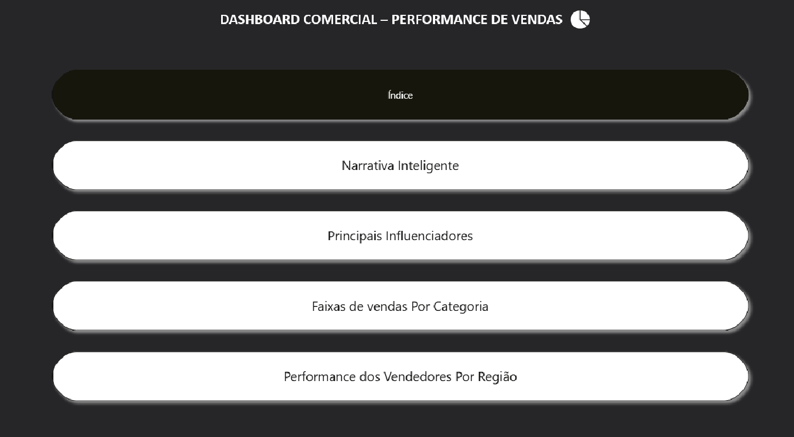
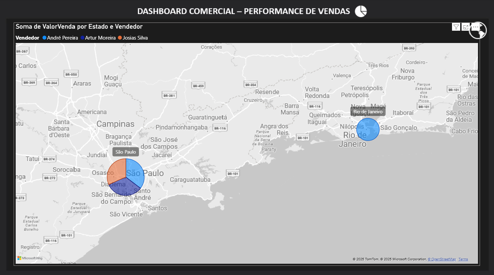

# Comercial
Este dashboard fornece uma visão detalhada sobre o desempenho de vendas, destacando a contribuição de fabricantes, categorias de produtos, segmentos de mercado e a performance da equipe de vendas por região.

1. Desempenho Geral e Fabricantes Chave
O Total Valor Venda consolidado pelo dashboard é de R$ 92.786,30, com a variação entre fabricantes indo de R$ 6.690,02 a R$ 92.786,30.

Liderança de Fabricante: A Brastemp domina o mercado, contribuindo com 25,82% do Total Valor Venda (R$ 93 Mil), sendo 1.286,94% maior que o fabricante com o menor valor total (Electrolux, com R$ 7 Mil). Outros fabricantes notáveis incluem Samsung (R$ 83 Mil), Consul (R$ 59 Mil) e Motorola (R$ 35 Mil).

2. Influenciadores de Vendas e Segmentação
A análise de influenciadores e segmentos é crucial para entender a dinâmica de aumento do valor da venda:

Segmento Corporativo: Este é o principal influenciador para o aumento do Valor da Venda, com uma Média de Valor da Venda em R$ 2.000, sendo significativamente superior aos segmentos Industrial (R$ 1.147,49) e Doméstico. O Segmento Corporativo é responsável por 71,47% do Valor Venda (R$ 256,8 Mil), demonstrando que o foco B2B (Business-to-Business) é o maior motor de receita.

Categoria Celulares: A categoria Celulares é o segundo maior influenciador para o aumento do Valor da Venda.

3. Performance por Categoria e Loja
A distribuição do valor da venda por categoria e loja revela onde o capital está concentrado:

Foco em Eletrodomésticos e Celulares: A categoria Eletrodomésticos é a maior em Valor Venda (R$ 193,32 Mil), seguida por Celulares (R$ 98,60 Mil). Juntas, estas duas categorias representam a maior fatia da receita.

Distribuição de Lojas: As lojas A9990 e A9991 são as que mais contribuem em volume de vendas. Eletrodomésticos é a categoria com a maior dispersão de lojas contribuintes, enquanto Eletroportáteis (R$ 19,06 Mil) é a de menor volume.

4. Performance Regional da Equipe de Vendas
A atuação da equipe de vendas está concentrada em polos regionais:

Concentração Geográfica: A performance de vendas está visivelmente concentrada em São Paulo (capital e região do ABC/Diadema) e Rio de Janeiro (capital).

Vendedores Chave: Os vendedores André Pereira, Artur Moreira e Josias Silva atuam majoritariamente nessas regiões, indicando que a força de vendas está bem posicionada nos maiores mercados do sudeste.

Ações Estratégicas Recomendadas
Priorizar o Segmento Corporativo: Dada a alta média de Valor Venda e a participação de 71,47%, o segmento Corporativo deve ser o foco principal para campanhas e alocação de recursos.

Manter Foco no Mix de Produtos: Garantir a disponibilidade e estratégias promocionais para Eletrodomésticos e Celulares, as categorias que geram o maior volume de receita.

Análise Regional: Estudar a fundo o sucesso dos vendedores nas regiões de São Paulo e Rio de Janeiro para replicar as melhores práticas em outras áreas.

