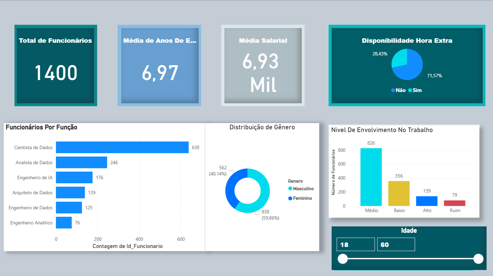

# RH
Resumo Executivo: Panorama Estratégico de Recursos Humanos

Total de Funcionários: A empresa possui 1400 colaboradores.

Experiência e Remuneração:

Média de Anos de Experiência: 6,97 anos, indicando um quadro de profissionais experientes.

Média Salarial Mensal: R$ 6,93 Mil, refletindo uma remuneração competitiva.

Disponibilidade para Hora Extra: 71,57% dos funcionários estão disponíveis, o que aponta para flexibilidade, mas também exige monitoramento de custos e prevenção de burnout.

Distribuição da Força de Trabalho por Função:

Forte concentração em funções técnicas, com 638 Cientistas de Dados, 246 Analistas de Dados e 176 Engenheiros de IA, destacando o perfil data-driven da organização.

Diversidade de Gênero:

A distribuição é desequilibrada: 60% Masculino vs. 40% Feminino.

Recomendação: É fundamental desenvolver iniciativas de Diversidade e Inclusão para promover maior equidade.

Nível de Envolvimento no Trabalho:

A maior parte dos funcionários se encontra no nível Médio (826) e Baixo (356).

Preocupante: 79 funcionários foram classificados com envolvimento "Ruim".

Ação Crítica: Há uma oportunidade clara e urgente para investir em programas de engajamento e desenvolvimento de lideranças para melhorar o clima organizacional e reter talentos.

Próximos Passos (Recomendações):

Promoções: Utilizar a coluna "Anos Desde Última Promoção" para definir critérios claros e planos de carreira.

Análise Preditiva: Aprofundar a análise de engajamento correlacionando-o com outros fatores (ex: tempo na empresa, idade) para prever e mitigar a rotatividade.

Faixa Etária: O dashboard permite filtrar dados entre 18 e 60 anos, essencial para entender o impacto das métricas em diferentes gerações.
